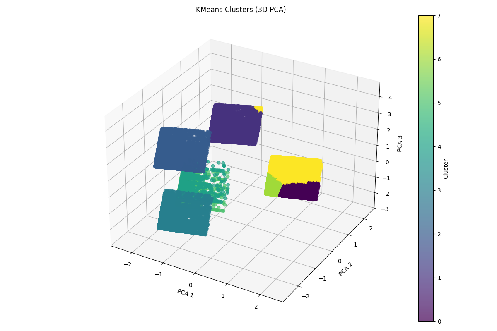

# 📚 Smart Book Recommender using Machine Learning & Generative AI

## Project Overview
This project focuses on building a personalized book recommendation system that combines the power of **Machine Learning (ML)**, **Natural Language Processing (NLP)** and **Generative AI (GenAI)**.  The recommendations are generated using **K-Means clustering**, **TF-IDF vectorization**, **VADER sentiment analysis**, and **OpenAI GPT for summaries**, all wrapped in an interactive Streamlit web app.

## Objective
The goal of this project is to create a book recommendation system that clusters books based on genre, review sentiment, and rating, and then suggests books tailored to user input. The app also generates AI-powered summaries for each recommendation and reveals the cluster category, offering a more meaningful and contextual recommendation.

## Project Workflow

### 🗂️ 1. Data Collection

- Used [Amazon Books Reviews dataset](https://www.kaggle.com/datasets/mohamedbakhet/amazon-books-reviews) from Kaggle

- Combined two datasets: one with book metadata (title, author, genre) and one with reviews

### 🧹 2. Data Preprocessing

- Cleaned the review texts

- Used lemmatization, punctuation removal, stopwords removal

- Created a new column `shortened_text` with the first 300 words of cleaned review text

- Combined `title`, `author`, `genre`, and `shortened_text` into a new column `combined_features` for better semantic matching

### 📈 3. Feature Engineering

- One-hot encoded genres for additional model inputs

- Applied **VADER sentiment analysis** to reviews and stored sentiment scores

### 🧪 4. Clustering

- Used **KMeans clustering** on scaled features (ratings, sentiment, and encoded genre)

- Used elbow method and silhouette score to determine the optimal number of clusters

- Assigned `cluster_label` to each book

- Analize and label the clusters

### 🧾 5. Text Vectorization

- Used **TfidfVectorizer** on `combined_features` for matching user queries to book profiles

- Transformed both dataset and user input into vectors

- Calculated **cosine similarity** between user input and books to find top recommendations

### 🤖 6. Summarization with Generative AI

- Used OpenAI GPT (gpt-4o) to generate short summaries of books based on title and author

### 🎨 7. Streamlit App

- Built a user-friendly interface where:

- User enters a preference query (e.g. “I want a mystery book by a female author”)

- App returns two top book matches with summary, rating, sentiment, and cluster

- Optional filter by cluster

- All backend logic (vectorization, filtering, GPT API calls) is integrated into the app

## Cluster Analysis

This project uses **K-Means Clustering** to categorize books based on genre, sentiment score, and average rating. Below is an interpretation of the clusters:

- **Cluster 0 — "Quiet Favorites"**  
  High-rated books with neutral sentiment. These are often **academic**, **technical**, or **non-fiction** reads that are informative and well-written, but not necessarily emotionally engaging.

- **Cluster 1 — Fiction**  
  Strongly associated with the **Fiction** genre.

- **Cluster 2 — Academic**  
  Contains mostly **Academic** books — theoretical, research-based, or study-related content.

- **Cluster 3 — Non-Fiction**  
  Comprised mainly of **Non-Fiction** books such as biographies, essays, and factual writing.

- **Cluster 4 — Poetry/Drama**  
  Books that fall under the **Poetry** or **Drama** genres — typically expressive, emotional, and artistic.

- **Cluster 5 — Children/Young Adult**  
  Books targeting a **Children** or **Young Adult** audience — imaginative, accessible, and often emotionally rich.

- **Cluster 6 — "Emotional Favorites"**  
  Books with **high sentiment and average score**. These are often emotionally resonant stories that readers love and recommend passionately.

- **Cluster 7 — Mediocre Books**  
  Books with **lower average ratings and sentiment scores**. These might be controversial, uneven in quality, or simply didn’t meet expectations.

  

## Additional content
- [Presentation](./docs/slides.pdf)
- [Developer setup](./docs/setup.md)